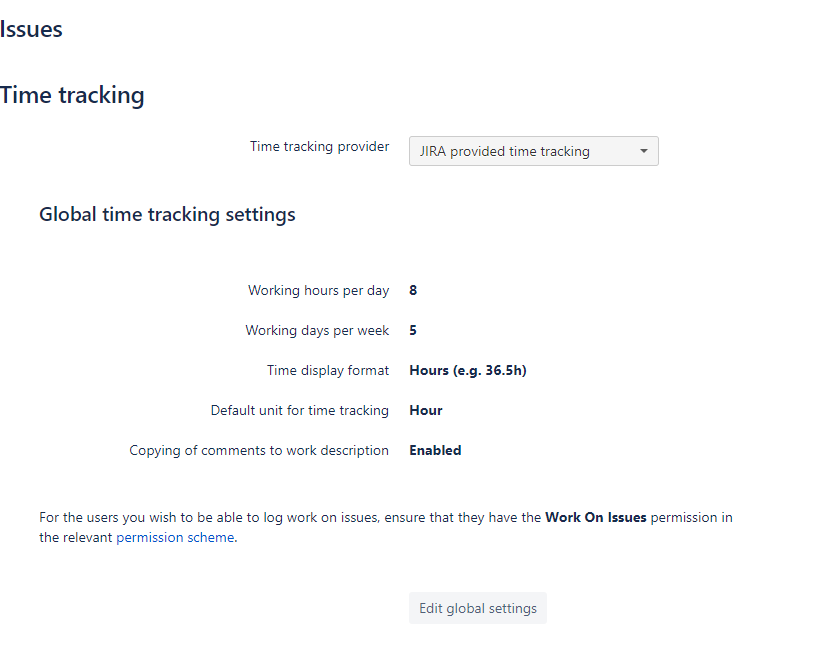
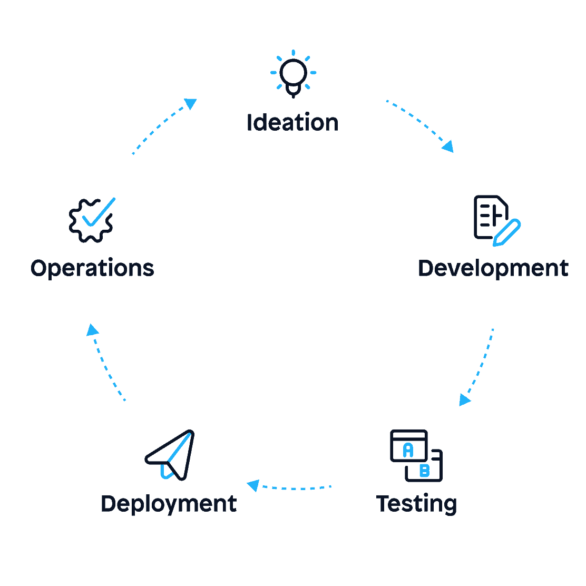

# GoJira

[![Build Status][build-status-svg]][build-status-url]
[![Lint Status][lint-status-svg]][lint-status-url]
[![Go Report Card][goreport-svg]][goreport-url]
[![CodeClimate][codeclimate-status-svg]][codeclimate-status-url]
[![Docs][docs-godoc-svg]][docs-godoc-url]
[![LOC][loc-svg]][loc-url]
[![License][license-svg]][license-url]

 [build-status-svg]: https://github.com/grokify/gojira/actions/workflows/ci.yaml/badge.svg?branch=main
 [build-status-url]: https://github.com/grokify/gojira/actions/workflows/ci.yaml
 [lint-status-svg]: https://github.com/grokify/gojira/actions/workflows/lint.yaml/badge.svg?branch=main
 [lint-status-url]: https://github.com/grokify/gojira/actions/workflows/lint.yaml
 [goreport-svg]: https://goreportcard.com/badge/github.com/grokify/gojira
 [goreport-url]: https://goreportcard.com/report/github.com/grokify/gojira
 [codeclimate-status-svg]: https://codeclimate.com/github/grokify/gojira/badges/gpa.svg
 [codeclimate-status-url]: https://codeclimate.com/github/grokify/gojira
 [docs-godoc-svg]: https://pkg.go.dev/badge/github.com/grokify/gojira
 [docs-godoc-url]: https://pkg.go.dev/github.com/grokify/gojira
 [loc-svg]: https://tokei.rs/b1/github/grokify/gojira
 [loc-url]: https://github.com/grokify/gojira
 [license-svg]: https://img.shields.io/badge/license-MIT-blue.svg
 [license-url]: https://github.com/grokify/gojira/blob/master/LICENSE

This module contains code to access Jira, parsing both the JSON API via [`github.com/andygrunwald/go-jira`](https://github.com/andygrunwald/go-jira) in `jirarest` and code to parse a Jira XML file in `jiraxml`.

Various aggregate staticstics and reports are calculated/generated.

## Use Cases

1. Programmatically construct JQL
1. Generate Markdown Reports from JQLs for addition to git repos or Confluence

## URL Formats

Accessing a list of issues by JQL is avialable via the UI and API:

* UI: `https://{jira_host}/issues/?jql=`
* API: `https://{jira_host}/rest/api/2/search?jql=`

### REST API Authentication: Basic Auth

The API auth can be provided by Basic Auth using an personsal API Token.

* Docs: https://developer.atlassian.com/cloud/jira/platform/basic-auth-for-rest-apis/
* Token Page: https://id.atlassian.com/manage-profile/security/api-tokens

## Note on Hours Per Day and Days Per Week

This module supports custom `hoursPerDay` and `daysPerWeek` settings per Jira.

This is described here and set in the UI via the screenshot below,

Ref: https://community.atlassian.com/t5/Jira-Software-questions/What-it-JIRA-counting-as-a-quot-day-quot-in-Time-Tracking/qaq-p/1703409

Also of note is that the hours per day can be set to a decimal value, such as `8.5`, but the UI may not show it:

Ref: https://community.atlassian.com/t5/Jira-questions/change-quot-Working-hours-per-day-quot-by-a-decimal-value/qaq-p/583095

## Additional Discussion on Jira XML

### General Discussion

General discussion including using Jira XML to:

1. export comments and issue link types
1. create CSV for flexible reporting and import

Ref: https://community.atlassian.com/t5/Jira-questions/JIRA-Issue-XML-Export-What-is-it-good-for/qaq-p/603308

### Global Config

Working Hours Per Day and Working Days Per Week are global values and cannot be set on a per-project basis.

Ref: https://community.atlassian.com/t5/Jira-Software-questions/Time-Tracking-Hours-Is-it-still-a-global-change/qaq-p/1337399

# JQL Examples

| Goal | Example |
|------|---------|
| Query by key | key = ABC-123 |
| Query by parent | parent = ABC-123 |
| Query by linked issue | issue in linkedIssues (ABC-123) |
| Query by reporter | reporter = "foo@bar.com" |

https://community.atlassian.com/t5/Jira-questions/How-to-search-all-linked-issues-with-issues-from-specific/qaq-p/1027269

## Backlog

Downloading the project backlog view appears to be challenging. Here is some info on attempts to do this.

* [What is the equivalent JQL query for a scrum board backlog](https://community.atlassian.com/t5/Jira-Software-questions/What-is-the-equivalent-JQL-query-for-a-scrum-board-backlog/qaq-p/868136)
* [How can I export the Backlog to csv or Excel or TXT?](https://community.atlassian.com/t5/Jira-Software-questions/How-can-I-export-the-Backlog-to-csv-or-Excel-or-TXT/qaq-p/1322548)

Roughly:

`project = <project_name> AND resolution = Unresolved AND status!=Closed AND (Sprint not in openSprints() OR Sprint is EMPTY) AND type not in (Epic, Sub-Task) ORDER BY Rank ASC`

## Agile Life Cycle Stages

Stage is a common way to understand the stages of development given that many companies can use different statuses and workflows.

Stage the following stages (from [Asana](https://asana.com/resources/agile-methodology)) and will provide a grouping capability for implementation-specific workflows into these standard meta statuses for consistent and canonical understanding of the process.

Not all the stages need to be used, however, the stages that are used can be understood in a canonical way.

*image courtesy of Asana*

An alternate, but related agile methodology is avialable from [eSparkBiz](https://www.esparkinfo.com/blog/difference-between-product-backlog-grooming-and-sprint-planning.html):

*image courtesy of eSparkBiz*

As well as from [BISS](https://handbook.bosphorusiss.com/way-of-working/process-design/agile-software-development-lifecycle/):

*image courtesy of BISS*

This is described as ["The 5 Stages of the Agile Software Development Lifecycle"](https://www.mendix.com/blog/agile-software-development-lifecycle-stages/) by Mendix.

*image courtesy of Mendix*